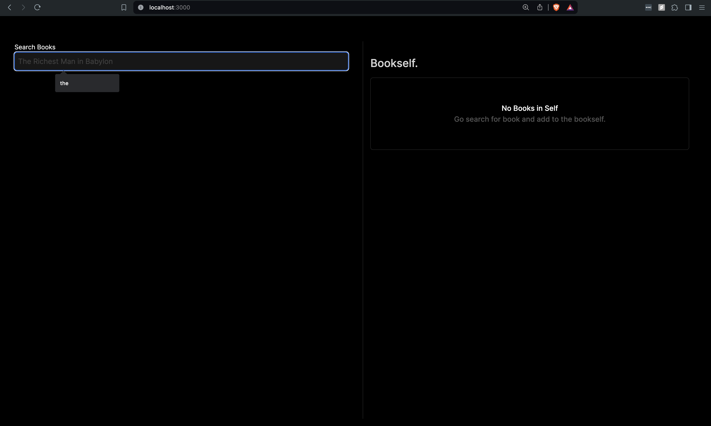
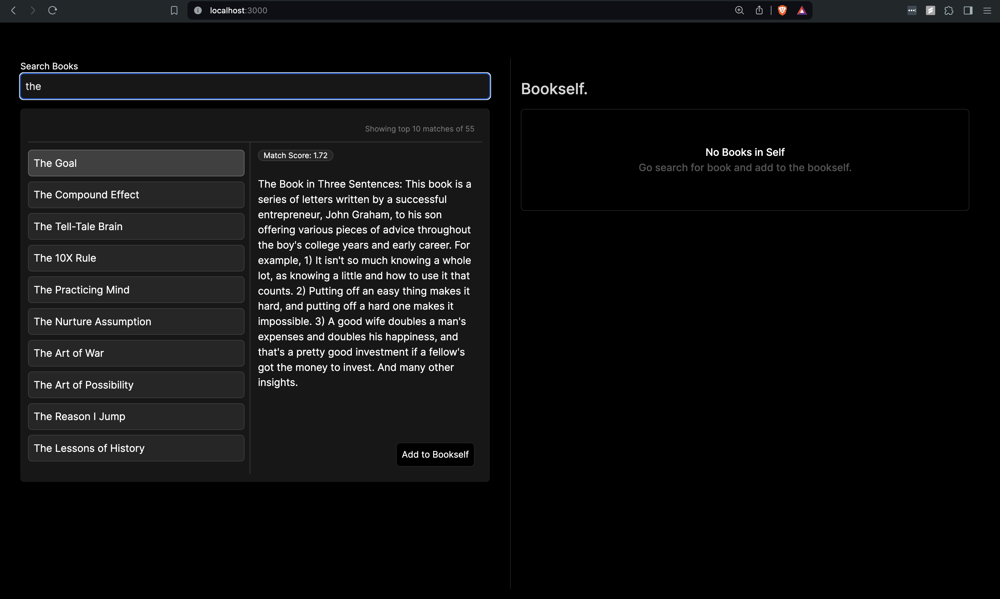
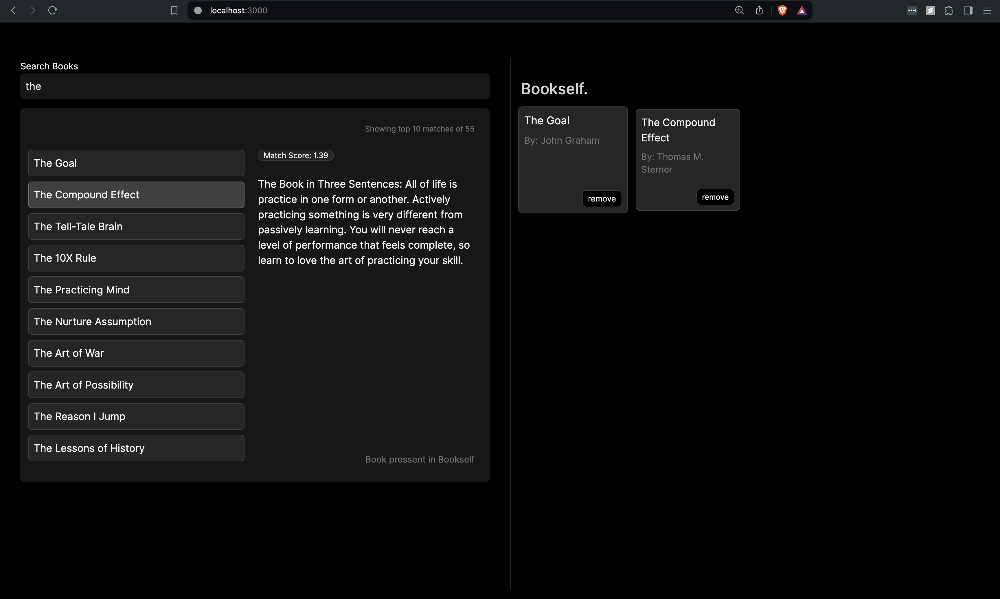

## Getting Started

### Pre-requsite

Make sure [NodeJs](https://nodejs.org/) is installed.

### Running locally 

Clone the repo

```
git clone git@github.com:JayMGurav/autocomplete-search.git
```

Install dependencies

```bash
npm install
```


First, run the development server:

```bash
npm run dev
```

Open [http://localhost:3000](http://localhost:3000) with your browser to see the result.

## Technologies used

1. [Next js](https://nextjs.org/)
2. [Orama search](https://github.com/askorama/orama)
3. [Zustand](https://github.com/pmndrs/zustand)


## APP images

1. Initial UI, without books added to self.


2. Search UI with top 10 suggesiton with score, book title, summary and add to self button.


3. Book added to Bookself. Scale on hover, button to remove book from self,


> Note: already added book doesn't show button to add to self